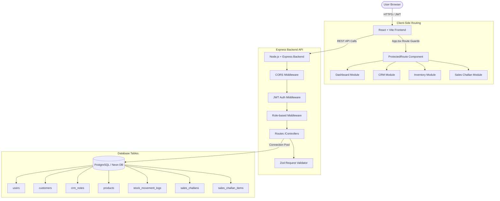
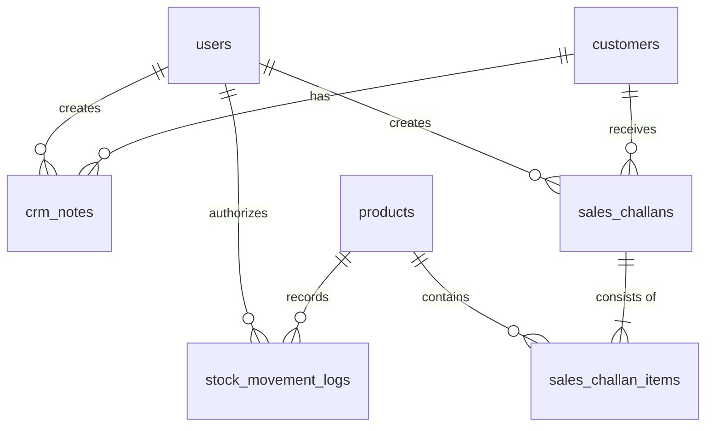

# Mini ERP + CRM Operations Portal
## Comprehensive Project Documentation (Parul University Round-1 Submission)

---

## Table of Contents
1. [Project Overview](#2-project-overview)
2. [Problem Statement](#3-problem-statement)
3. [Objectives](#4-objectives)
4. [Key Features](#5-key-features)
5. [User Roles & Permissions](#6-user-roles-permissions)
6. [Application Modules](#7-application-modules)
7. [System Architecture](#8-system-architecture)
8. [Frontend Architecture](#9-frontend-architecture)
9. [Backend Architecture](#10-backend-architecture)
10. [Database Schema](#11-database-schema)
11. [API Documentation](#12-api-documentation)
12. [Authentication & Security](#13-authentication-security)
13. [Role-Based Workflows](#14-role-based-workflows)
14. [Sample Seed Data](#15-sample-seed-data)
15. [Testing & Verification](#16-testing-verification)
16. [Deployment Architecture](#17-deployment-architecture)
17. [Environment Variables](#18-environment-variables)
18. [Local Development Setup](#19-local-development-setup)
19. [Production Deployment](#20-production-deployment)
20. [Screenshots & Demo Placeholders](#21-screenshots-demo-placeholders)
21. [Demo Accounts](#22-demo-accounts)
22. [Project Repository](#23-project-repository)
23. [Live Application](#24-live-application)
24. [Future Enhancements](#25-future-enhancements)
25. [Conclusion](#26-conclusion)

---

## 2. Project Overview
The **Mini ERP + CRM Operations Portal** is a production-grade, full-stack enterprise operations platform tailored for wholesale distribution, catalog tracking, customer relationship management (CRM), and transactional sales challan processing. 

### Why Combine ERP and CRM?
Wholesale and distribution companies typically suffer from fragmented workflows where customer interactions (CRM) are disconnected from stock movements, inventory alerts, and sales billing (ERP). This integration resolves information silos:
* **Unified Workspace**: Bridges the gap between sales lead logging and inventory allocation.
* **Consistency**: Ensures unit price, customer profile, and stock movement logs synchronize immediately during the transaction lifecycle.
* **Stateless Flow**: Integrates real-time inventory adjustments with role-restricted draft-to-confirmation sales workflows.

---

## 3. Problem Statement
Wholesale/distribution businesses face operational hurdles:
1. **Disconnected Systems**: Customer data in spreadsheets does not interact with live warehouse stock sheets, resulting in delayed processing.
2. **Stock Discrepancy & Over-allocation**: Sales agents confirm order quantities that do not exist, leading to unfulfilled delivery timelines.
3. **Audit Lack**: Stock increases or reductions happen manually without recording why or who performed the adjustment.
4. **Security Vulnerabilities**: Unauthorized personnel accessing pricing catalogs or customer lead database sheets.

This system provides a single source of truth containing transactional safety controls, strict role hierarchies, and atomic database isolation checks to resolve these operational bottlenecks.

---

## 4. Objectives
* **Centralized Data Management**: A secure PostgreSQL database to store customers, catalogs, notes, transactions, and logs.
* **Role-Based Access Control (RBAC)**: Fine-grained user boundaries (Admin, Sales, Warehouse, Accounts) on both frontend and backend.
* **CRM Management**: Dynamic status-based customer cards, historical timeline notes, and scheduled follow-ups.
* **Inventory Control**: Real-time catalog lookup, stock levels, warehouse coordinates, and low-stock alerts.
* **Sales Challan Generation**: Atomic transactions converting draft sales allocations into confirmed inventory deductions with rollback capabilities.
* **Secure API Communication**: JWT-authenticated REST APIs utilizing input schemas validation.
* **Modern Deployment**: Serverless hosting optimized for fast delivery and secure database pooling.

---

## 5. Key Features
- **Stateless Authentication**: JWT-based login featuring local storage persistence and automated token-refresh checks.
- **Dynamic Role Dashboards**: Adaptive dashboard panels that display key metrics relevant to each logged-in role.
- **Interactive CRM File**: Customer tracking board with contact records, business types, GST registry, and client history note timelines.
- **Product Catalog & Stock Management**: Real-time search, category filters, shelf location mapping, and color-coded low-stock warnings.
- **Challan Transaction Lifecycle**: Draft creation, atomic stock validation upon confirmation, inventory deduct, and invoice cancel rollbacks.
- **Route Protections**: Strict client-side route guards alongside server-side role validation middleware.
- **Postgres Database**: Relational schema containing constraints, cascade rules, and index optimization.
- **Sample Seed Data**: Automated populating scripts to seed realistic wholesale environments for testing.
- **Integration Tests**: Jest integration suites validating API route security boundaries and challan concurrency limits.

---

## 6. User Roles & Permissions

The application enforces a strict role permission matrix on both UI modules and REST endpoints:

| Feature / Module | Route | Admin | Sales | Warehouse | Accounts |
| :--- | :--- | :---: | :---: | :---: | :---: |
| **System Dashboard** | `/` | Read/Write | Read/Write | Read/Write | Read/Write |
| **CRM Customer File** | `/crm` | Read/Write | Read/Write | Denied | Read-Only |
| **Product Catalog** | `/inventory` | Read/Write | Read-Only | Read/Write | Read-Only |
| **Stock Adjustments** | API Endpoint | Read/Write | Denied | Read/Write | Denied |
| **Sales Challans** | `/challans` | Read/Write | Read/Write (Drafts/Confirm) | Read/Write (Cancel) | Read-Only |
| **PDF Challan Export** | API Endpoint | Read | Read | Read | Read |

---

## 7. Application Modules

### A. Authentication & Gatekeeper
* Prevents unauthenticated users from bypassing login.
* Provides pre-configured quick login buttons for all 4 roles to speed up demonstration flows.

### B. Command Center (Dashboard)
* Summarizes operational metrics in real-time.
* Displays dynamic widgets: Active Leads Count, Products Low in Stock, Draft Challans, and Active Allocations.
* Restricts visibility of metric counts based on role access profiles.

### C. Customer Relations (CRM)
* Houses a list of all client relationships (Lead, Active, Inactive).
* Features search by name, business, email, or mobile.
* Clicking on any customer card slides out the **Notes Timeline Drawer**, allowing Sales/Admin to view history and append new notes.

### D. Inventory Catalog & Movements
* Lists SKU codes, item categories, wholesale pricing, and coordinates.
* Alerts the warehouse if stock falls below the minimum limit.
* Clicking on an item exposes the **Stock adjustment interface** and **Audit Log Timeline**, displaying the chronological log of stock movements (IN/OUT) with reason and author.

### E. Sales Challan Invoice Engine
* Creates invoices mapped to customers with snapshots of their details.
* Saves challans as **Drafts** (reserves no stock) or confirms them to deduct inventory and log the movements.
* Allows download of clean, generated invoice PDFs.

---

## 8. System Architecture



---

## 9. Frontend Architecture
The client is structured as a React Vite SPA utilizing TypeScript and vanilla CSS for styling:

```text
frontend/src/
├── main.tsx                # Entry point rendering App.tsx inside React DOM
├── App.tsx                 # Core Router, route layout paths, and ProtectedRoute guards
├── App.css                 # CSS variables, color tokens, and animation definitions
├── index.css               # Body resets and font family loading
├── assets/                 # SVGs and vector image components
├── context/
│   └── AuthContext.tsx     # Provides User profile, JWT persistence, and login/logout state
├── layouts/
│   └── DashboardLayout.tsx # Sticky Sidebar navigation, Role badge, and Logout triggers
└── pages/
    ├── Login.tsx           # Form view with credentials autofill selectors
    ├── Dashboard.tsx       # Live status indicators and grid widgets
    ├── Crm.tsx             # Board management for customers and historical notes
    ├── Inventory.tsx       # Products catalog table, stock adjustment form, and movement logs
    └── SalesChallans.tsx   # Transactional challan builder, status flows, and PDF links
```

* **Routing Guard**: [App.tsx](file:///Users/lokeshsharma/fundsroominfotech/frontend/src/App.tsx) handles redirection using [ProtectedRoute](file:///Users/lokeshsharma/fundsroominfotech/frontend/src/App.tsx#L11-L32) to prevent unauthorized route access.
* **Authentication Context**: [AuthContext.tsx](file:///Users/lokeshsharma/fundsroominfotech/frontend/src/context/AuthContext.tsx) manages the authorization headers and user object in local storage.

---

## 10. Backend Architecture
The API server is built with Express.js and TypeScript, using raw PostgreSQL connections to enforce high performance and relational safety:

```text
backend/src/
├── app.ts                   # Express server bootstrap, middleware registry, and CORS setup
├── config/
│   └── db.ts                # PostgreSQL pg.Pool connection parameters with SSL hooks
├── db/
│   ├── schema.ts            # DDL scripts defining tables, types, keys, and validations
│   └── seed.ts              # DML scripts seeding mock datasets for testing
├── middlewares/
│   ├── auth.ts              # JWT token verification and Role verification layers
│   └── validate.ts          # Zod validation schema parsing middleware
├── routes/
│   ├── auth.ts              # Authentication routes (/login, /me)
│   ├── customers.ts         # CRM clients and notes API endpoints
│   ├── products.ts          # Product catalog and stock adjustments API endpoints
│   └── challans.ts          # Transactional challan creation, patch, and PDF download
└── tests/
    └── integration.test.ts  # Jest test suites verifying RBAC blockades and transactional logic
```

* **Relational Security**: The backend leverages PostgreSQL transaction isolation blocks (`BEGIN`, `COMMIT`, `ROLLBACK`) and lock clauses (`FOR UPDATE`) to ensure inventory cannot become negative when multiple users process challans concurrently.

---

## 11. Database Schema

The database consists of 7 relational tables defined in [schema.ts](file:///Users/lokeshsharma/fundsroominfotech/backend/src/db/schema.ts):



### Table Specifications

#### 1. `users`
Represents the system users and their security permissions.
* `id`: UUID (Primary Key)
* `username`: VARCHAR(100) (Unique, Not Null)
* `email`: VARCHAR(255) (Unique, Not Null)
* `password_hash`: VARCHAR(255) (Not Null)
* `role`: VARCHAR(50) (Checked: 'Admin', 'Sales', 'Warehouse', 'Accounts')
* `created_at`: TIMESTAMP

#### 2. `customers`
Stores CRM contacts and current lead stages.
* `id`: UUID (Primary Key)
* `name`: VARCHAR(255) (Not Null)
* `mobile`: VARCHAR(20) (Not Null)
* `email`: VARCHAR(255) (Not Null)
* `business_name`: VARCHAR(255) (Not Null)
* `gst_number`: VARCHAR(15) (Optional)
* `type`: VARCHAR(50) (Checked: 'Retail', 'Wholesale', 'Distributor')
* `address`: TEXT (Not Null)
* `status`: VARCHAR(50) (Checked: 'Lead', 'Active', 'Inactive')
* `follow_up_date`: DATE (Optional)
* `notes`: TEXT (Optional)
* `created_at`: TIMESTAMP

#### 3. `crm_notes`
Historical timeline entries for customer interactions.
* `id`: UUID (Primary Key)
* `customer_id`: UUID (Foreign Key -> `customers(id)`, ON DELETE CASCADE)
* `note`: TEXT (Not Null)
* `created_by`: UUID (Foreign Key -> `users(id)`, ON DELETE SET NULL)
* `created_at`: TIMESTAMP

#### 4. `products`
The warehouse inventory pricing and stock coordinates.
* `id`: UUID (Primary Key)
* `name`: VARCHAR(255) (Not Null)
* `sku`: VARCHAR(100) (Unique, Not Null)
* `category`: VARCHAR(100) (Not Null)
* `unit_price`: NUMERIC(12, 2) (Check: >= 0)
* `current_stock`: INT (Check: >= 0)
* `min_stock_alert`: INT (Check: >= 0)
* `location`: VARCHAR(255) (Not Null)
* `created_at`: TIMESTAMP

#### 5. `stock_movement_logs`
Audit log recording every stock change.
* `id`: UUID (Primary Key)
* `product_id`: UUID (Foreign Key -> `products(id)`, ON DELETE CASCADE)
* `quantity`: INT (Not Null)
* `movement_type`: VARCHAR(10) (Checked: 'IN', 'OUT')
* `reason`: VARCHAR(255) (Not Null)
* `created_by`: UUID (Foreign Key -> `users(id)`, ON DELETE SET NULL)
* `created_at`: TIMESTAMP

#### 6. `sales_challans`
Sales transaction records.
* `id`: UUID (Primary Key)
* `challan_number`: VARCHAR(100) (Unique, Not Null)
* `customer_id`: UUID (Foreign Key -> `customers(id)`, ON DELETE RESTRICT)
* `customer_snapshot`: JSONB (Stores client snapshot at transaction time)
* `total_quantity`: INT (Check: > 0)
* `status`: VARCHAR(50) (Checked: 'Draft', 'Confirmed', 'Cancelled')
* `created_by`: UUID (Foreign Key -> `users(id)`, ON DELETE SET NULL)
* `created_at`: TIMESTAMP

#### 7. `sales_challan_items`
Individual items within a sales challan.
* `id`: UUID (Primary Key)
* `challan_id`: UUID (Foreign Key -> `sales_challans(id)`, ON DELETE CASCADE)
* `product_id`: UUID (Foreign Key -> `products(id)`, ON DELETE SET NULL)
* `product_sku_snapshot`: VARCHAR(100) (Preserves SKU at invoice creation)
* `product_name_snapshot`: VARCHAR(255) (Preserves product name at invoice creation)
* `unit_price_snapshot`: NUMERIC(12, 2) (Preserves unit price at invoice creation)
* `quantity`: INT (Check: > 0)

---

## 12. API Documentation

The REST endpoints are defined in [app.ts](file:///Users/lokeshsharma/fundsroominfotech/backend/src/app.ts):

| Method | Endpoint | Purpose | Required Auth / Role |
| :--- | :--- | :--- | :--- |
| **POST** | `/api/auth/login` | Authenticate user credentials and return JWT | None |
| **GET** | `/api/auth/me` | Fetch authenticated user profile details | JWT (Any Role) |
| **GET** | `/api/customers` | Search/list customers (with pagination & filters) | JWT (Admin, Sales, Accounts) |
| **GET** | `/api/customers/:id` | Fetch specific customer profile | JWT (Admin, Sales, Accounts) |
| **POST** | `/api/customers` | Create a new customer lead | JWT (Admin, Sales) |
| **PUT** | `/api/customers/:id` | Update customer record | JWT (Admin, Sales) |
| **GET** | `/api/customers/:id/notes` | Fetch notes history timeline | JWT (Admin, Sales, Accounts) |
| **POST** | `/api/customers/:id/notes` | Append new note to timeline | JWT (Admin, Sales) |
| **GET** | `/api/products` | Search/list product catalog | JWT (Any Role) |
| **GET** | `/api/products/:id` | Fetch specific product | JWT (Any Role) |
| **POST** | `/api/products` | Add a new product to inventory | JWT (Admin, Warehouse) |
| **PUT** | `/api/products/:id` | Update product catalog details | JWT (Admin, Warehouse) |
| **POST** | `/api/products/:id/adjust-stock` | Perform manual stock adjustments | JWT (Admin, Warehouse) |
| **GET** | `/api/products/:id/movements` | List audit movements log | JWT (Any Role) |
| **GET** | `/api/challans` | List all sales challans | JWT (Any Role) |
| **GET** | `/api/challans/:id` | Fetch specific challan items and invoice snapshot | JWT (Any Role) |
| **POST** | `/api/challans` | Create new draft or confirmed sales challan | JWT (Admin, Sales) |
| **PATCH** | `/api/challans/:id/status` | Confirm or Cancel challan and update stock | JWT (Admin, Sales, Warehouse) |
| **GET** | `/api/challans/:id/pdf` | Generate and download challan invoice PDF | JWT (Any Role) |
| **GET** | `/api/health` | Service status checks | None |

---

## 13. Authentication & Security
1. **JWT Authentication**: User credentials verified against a `bcryptjs` password hash. On success, a stateless JSON Web Token signed with a 24-hour expiration is returned.
2. **Backend Protection**: Incoming requests pass through [authenticateToken](file:///Users/lokeshsharma/fundsroominfotech/backend/src/middlewares/auth.ts#L12-L27) middleware which extracts the token from the header and validates it.
3. **Role Authorization**: Server endpoints use [authorizeRoles(...allowedRoles)](file:///Users/lokeshsharma/fundsroominfotech/backend/src/middlewares/auth.ts#L29-L41) to intercept unauthorized actions before processing queries.
4. **CORS Safe-Listing**: Configured to reject request origins that are not in the approved localhost or production lists.
5. **Atomic Transactions**: Critical operations (e.g. confirming a challan and adjusting stock) are executed inside database transactions to ensure consistency.

---

## 14. Role-Based Workflows

### 💼 Admin Workflow
1. Log in. Access complete charts and system settings.
2. Oversee customer creation, modify catalog prices, edit inventory configurations, and audit all warehouse logs.
3. Generate, confirm, or cancel challan transactions.

### 📈 Sales Workflow
1. Log in. Create and search customer leads, log notes after customer calls, and check product stock levels.
2. Build sales challans as **Drafts** for customer approval.
3. Once approved, mark challans as **Confirmed**, which automatically deducts inventory and registers the outgoing stock logs.

### 📦 Warehouse Workflow
1. Log in. View catalog inventory, check alert panels for items with low stock, and perform manual stock adjustments.
2. View and review active sales challans.
3. Cancel confirmed challans if items fail QC, which automatically restores the reserved inventory back to catalog counts.

### 📊 Accounts Workflow
1. Log in. Access read-only dashboards showing inventory, customer records, and notes.
2. Review sales challans and download/print challan invoices as PDFs for tax filing.

---

## 15. Sample Seed Data
The database is preloaded with realistic records configured inside [seed.ts](file:///Users/lokeshsharma/fundsroominfotech/backend/src/db/seed.ts):
* **4 Operational Users**: Admin, Sales, Warehouse, and Accounts accounts.
* **50 Customers**: Fictional business names and details across 15 cities, categorized as Retail, Wholesale, and Distributor.
* **30 Products**: Items with structured SKU codes, pricing, warehouse locations, and stock counts.
* **100 Notes**: Seeded CRM customer timeline files.
* **28 Sales Challans**: Historic records in Draft, Confirmed, and Cancelled states.
* **60 Stock Movements**: Audit history log.

---

## 16. Testing & Verification

The project includes an integration test suite implemented in Jest that targets the business rules of the platform:

```bash
# Executing test command in backend/
npm test
```

### Verified Test Results (9 / 9 Passing)
* **RBAC Controls**:
  - `Admin` can fetch customer files (returns 200 OK).
  - `Warehouse` user blocked from fetching customer files (returns 403 Forbidden).
  - `Sales` user blocked from adjusting catalog stock (returns 403 Forbidden).
  - `Warehouse` user permitted to adjust catalog stock (returns 200 OK).
* **Transactional integrity**:
  - Creating a **Draft** challan does NOT deduct stock levels.
  - Patching status to **Confirmed** deducts stock levels and logs an `OUT` movement.
  - Attempting to confirm an already confirmed challan returns a 400 Bad Request.
  - Patching status to **Cancelled** returns stock levels and logs an `IN` movement.
  - **Over-allocation checks**: Attempting to confirm a challan when quantity exceeds current stock fails with `Insufficient stock` (returns 400 Bad Request).

---

## 17. Deployment Architecture

The application is deployed across cloud services:

```text
GitHub (Source Control)
   │
   ├───> Render (Backend API Host) ──────> https://mini-erp-crm-portal-56sd.onrender.com
   │
   ├───> Vercel (Frontend Client Host) ──> https://mini-erp-crm-portal-wbgw.vercel.app
   │
   └───> Neon (Cloud Serverless Postgres) ──> Dedicated relational cluster
```

---

## 18. Environment Variables

Documented variable names required for operations:

### Backend Environments (`backend/.env`)
* `PORT`: The API port (default: 5050)
* `DATABASE_URL`: Connection string (`postgresql://<user>:<password>@<host>:<port>/<database>`)
* `JWT_SECRET`: Security salt string used to sign client tokens
* `NODE_ENV`: Current environment mode (`development` or `production`)
* `FRONTEND_URL`: CORS origin validation target (e.g. `http://localhost:5173`)

### Frontend Environments (`frontend/.env`)
* `VITE_API_BASE_URL`: Base REST address (e.g. `http://localhost:5050/api` or production URL)

---

## 19. Local Development Setup

### 1. Prerequisites
* Node.js (v18+)
* PostgreSQL (v14+) or use the local postgres binary commands below

### 2. Database Server Sandbox Initializing
```bash
# 1. Initialize data cluster
/Library/PostgreSQL/18/bin/initdb -D ./db_data -U postgres --auth=trust

# 2. Start the database server on port 5433
/Library/PostgreSQL/18/bin/pg_ctl -D ./db_data -o "-p 5433" -l ./db_data/server.log start

# 3. Create the database
/Library/PostgreSQL/18/bin/createdb -h localhost -p 5433 -U postgres mini_erp
```

### 3. Backend API Setup
```bash
cd backend
npm install

# Configure environment variables in backend/.env:
# PORT=5050
# DATABASE_URL=postgresql://postgres@localhost:5433/mini_erp
# JWT_SECRET=supersecretkeyformini_erp_crm_system_2026

# Run migrations and seed data
npm run schema
npm run seed

# Start API server in dev mode
npm run dev
```

### 4. Frontend UI Setup
```bash
cd ../frontend
npm install

# Start Vite server
npm run dev
```
Open [http://localhost:5173/](http://localhost:5173/) in your web browser.

---

## 20. Production Deployment

### A. Database (Neon)
1. Register on Neon.tech and spin up a PostgreSQL instance.
2. Copy the connection string and apply it as the `DATABASE_URL` env variable in the backend.

### B. Backend API (Render)
1. Connect the GitHub repository to a Web Service on Render.
2. Select Environment: `Node`, and Set Build Command: `npm install && npm run build` (inside backend).
3. Set Start Command: `npm start` (inside backend).
4. Register environment variables.

### C. Frontend Client (Vercel)
1. Add a project in Vercel and import the repository.
2. Set directory root to `frontend`.
3. Select Framework: `Vite`.
4. Set Environment Variable: `VITE_API_BASE_URL` pointing to the Render backend URL (appended with `/api`).
5. Click deploy.

---

## 21. Screenshots & Demo Placeholders

Below are placeholders where screenshots of the running system can be embedded:

* **Login Panel**: Displays fields and demo account login selectors.
  ``
* **Admin Dashboard Overview**: Shows CRM counts, inventory levels, and system status widgets.
  ``
* **CRM Operations Board**: Displaying active customer cards and note slideouts.
  ``
* **Inventory Catalog**: Product grids with low-stock alerts.
  ``
* **Challan Creation Form**: Order selection page with invoice generation buttons.
  ``

---

## 22. Demo Accounts
The system is pre-configured with the following demo credentials (for demonstration purposes only):

| Username | Password (DEMO ONLY) | Role | Purpose |
| :--- | :--- | :--- | :--- |
| **admin** | `admin123` | **Admin** | System configuration, pricing, and system-wide edits |
| **sales** | `sales123` | **Sales** | Lead tracking, notes creation, and draft challan issuance |
| **warehouse** | `warehouse123` | **Warehouse** | Inventory adjustments, location tracking, and challan cancellation |
| **accounts** | `accounts123` | **Accounts** | Financial audit, challan inspection, and invoice PDF printing |

---

## 23. Project Repository
* **GitHub Repository URL**: [https://github.com/lokesh9173/mini-erp-crm-portal](https://github.com/lokesh9173/mini-erp-crm-portal)

---

## 24. Live Application
* **Production Frontend Client URL**: [https://mini-erp-crm-portal-wbgw.vercel.app](https://mini-erp-crm-portal-wbgw.vercel.app)
* **Production Backend API URL**: [https://mini-erp-crm-portal-56sd.onrender.com](https://mini-erp-crm-portal-56sd.onrender.com)

---

## 25. Future Enhancements
* **Advanced Analytics Dashboard**: Graphical representations of monthly sales and product category turnovers.
* **Low Stock Email Notifications**: Scheduled cron notifications alerts when stocks go low.
* **Bulk Import Utility**: Support for importing CSV catalog files to speed up inventory setup.
* **Audit Trail Exporter**: A dedicated search utility to export historical stock movements.

---

## 26. Conclusion
The **Mini ERP + CRM Operations Portal** provides a secure, lightweight operational engine for wholesale and distribution companies. By combining CRM contact history tracking with transactional ERP inventories, the system eliminates communication delays, checks stock levels during checkout, and logs every movement. Built on a modern full-stack stack (Vite + React, Express + TypeScript, PostgreSQL), this system is a robust solution for company operations.
